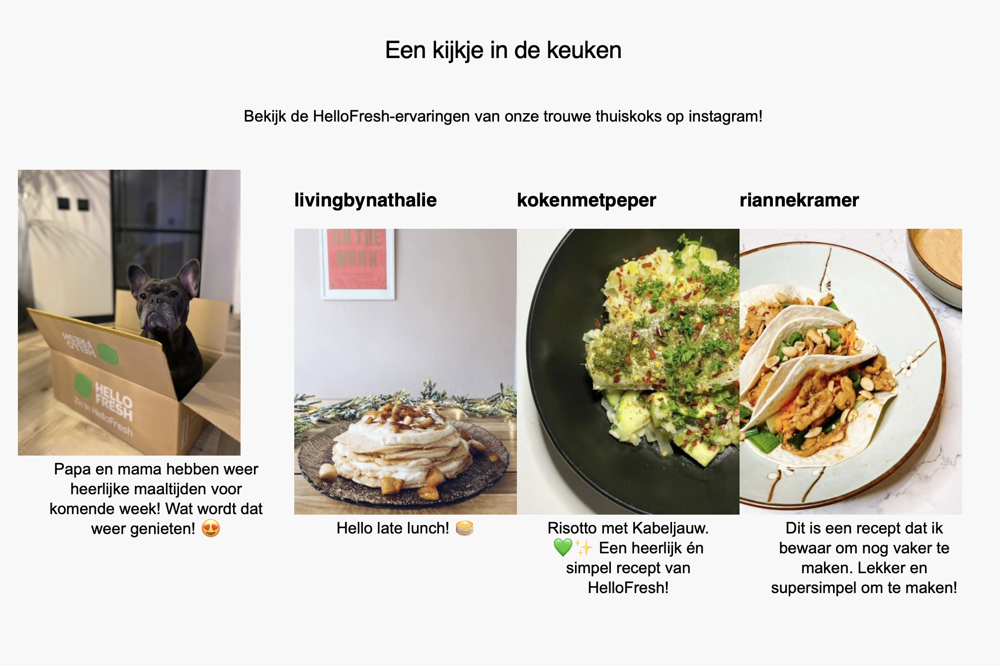

# Procesverslag
Markdown is een simpele manier om HTML te schrijven.  
Markdown cheat cheet: [Hulp bij het schrijven van Markdown](https://github.com/adam-p/markdown-here/wiki/Markdown-Cheatsheet).

Nb. De standaardstructuur en de spartaanse opmaak van de README.md zijn helemaal prima. Het gaat om de inhoud van je procesverslag. Besteedt de tijd voor pracht en praal aan je website.

Nb. Door *open* toe te voegen aan een *details* element kun je deze standaard open zetten. Fijn om dat steeds voor de relevante stuk(ken) te doen.

## Jij

  
uitwerken voor kick-off werkgroep

  ### Auteur:
  Karenza de Koop

  #### Je startniveau:
  Mijn startniveau ligt wel bij blauw en wil mezelf zeker uitdagen om naar rood te werken 

  #### Je focus:
  Mijn focus ligt bij responsiveness en ga een responsive website namaken  
 
 

## Je website

  
uitwerken voor kick-off werkgroep

  ### Je opdracht:
  link naar de website die ik ga namaken 
  https://www.hellofresh.nl
  #### Screenshot(s) van de eerste pagina (small screen): 
  Home pagina
  

  #### Screenshot(s) van de tweede pagina (small screen):
  hier de naam van de pagina  
  
 

## Toegankelijkheidstest 1/2 (week 1)

  
uitwerken na test in 1e werkgroep

  ### Bevindingen
  Lijst met je bevindingen die in de test naar voren kwamen:

  #### Screenreader
  De screenreader geeft goed aan wanneer je op een button ben en leest oop duidelijk op wat er op de pagina staat. Ik kan dit ook makkelijk bedienen met de pijltjes. Enige wat me wel opviel is dat het niet op alle paginas heel soepel werkt en dat ik de navigatie niet kon selecteren om te lezen. 

  Hoe ga ik dit oplossen? 
  Door de html semanthisch en foutloos te schrijven. Hierddor kan de screenreader duidelijker zijn 

  #### Muis en Toetsenbord 
  Met de tab kan je niet heel soepel door de website heen klikken. Het springt meteen naar het einde van de website en gaat niet door alle elementen. De hover state werkt wel. Het wordt duidelijk aangegeven wanneer je op een button of op een link ben.

  Hoe ga ik dit oplossen?
  Door duidelijk alles een element te geven en te werken met Aria-labels kan je beter door de website tabben

  #### Motoriek (shocks, elastiekjes)
  Met de elastiekjes heb ik niet een groot verschil gezien.
  Met de shocks ging het wel wat moeilijker... je kan niet heel stabiel door de website heen scrollen en en je begint perongelijk op andere buttons te klikken als ze te dicht op elkaar staan.

 Hoe kan ik dit oplossen?
 Hiervoor is er niet een hele goede oplossing maar eventueel zou kunnen is rekening houden met hoe dichtbij de buttons op elkaar staan.

  #### Visueel (brillen, contrast, kleurenblind, dark/light). 
  Met de brillen was het een beetje vanzelfsprekend. als iemand niet goed kan zien zijn de kleine letters ook wat moielijker om te lezen. Als je kleurenblind ben dan is mijn website niet heel moeilijk. Het contrast tussen de kleuren zijn heel duidelijk dus je kan er gewoon makkelijk door heen 

  Hoe ga ik dit oplossen?
  Een optie hebben om de lettertype groter te maken voor mensen die wat moeilijker kunnen zien kan een goede oplossing zijn hiervoor.

## Breakdownschets (week 1)

  
uitwerken na afloop 2e werkgroep

  ### de hele pagina: 
  

## Voortgang 1 (week 2)

  
uitwerken voor 1e voortgang

  ### Stand van zaken
  hier dit ging goed & dit was lastig (neem ook screenshots op van delen van je website en code)

  ### Agenda voor meeting
  samen met je groepje opstellen

  | Karenza        | student 2          | student 3    | student 4        |
  | ---            | ---                | ---          | ---              |
  | vragen of de   | en dit             | en ik dit    | en dan ik dat    |
  | HTML goed was  | dit als er tijd is | nog een punt | dit wil ik zeker |
  | css nog niet   | ...                | ...          | ...              |

  ### Verslag van meeting
  hier na afloop snel de uitkomsten van de meeting vastlegen
  - "buttons" brengen je naar andere pagina dus gewoon als link doen en laten in css vormgeven
  - Alleen 1 H1 mogelijk
  - de banners mag ik een div gebruiken 
  - de H'tjes moeten boven de fotos en dan later volgorde veranderen in css.

## Voortgang 2 (week 3)

  
uitwerken voor 2e voortgang

  ### Stand van zaken
  hbegin gemaakt aan css maar heb aantal stuggels gehad met het selecteren van de elementen dus wil even verder vragen voordat ik goed verder kan. ook is me font niet goed en heb ik aantal vragen over flexbox 
  

  ### Agenda voor meeting
  samen met je groepje opstellen

  - Elaine: Hoe link je een a href naar een section zonder class/id voor skip content

  - Shelley: Mag ik voor de carousel van mijn productpagina (column carousel) gebruik maken van  div & class? Ik heb tutorials online gekeken en kom er niet uit aangezien ze dit overal toevoegen

  - Karenza: Graag extra verduidelijking CSS grid & flexbox + fonts.

  - Lisanne:

  ### Verslag van meeting
  hier na afloop snel de uitkomsten van de meeting vastleggen

  - als je de H onder de foto wil moet je letten op order in de css
  - > is derect child 
  - overflow kan je gerbuiken bij een carousell
  - verschil tussen display block en display inline
-

## Toegankelijkheidstest 2/2 (week 4)
(deze week doen, voor de herkansing)

  
uitwerken na test in 8e werkgroep

  ### Bevindingen
  Lijst met je bevindingen die in de test naar voren kwamen (geef ook aan wat er verbeterd is):

  #### Screenreader
  Hier korte omschrijving (met indien nodig afbeeldingen)

  Hier een omschrijving van hoe het opgelost kan worden (met indien nodig afbeeldingen)

  #### Muis en Toetsenbord 
  Hier korte omschrijving (met indien nodig afbeeldingen)

  Hier een omschrijving van hoe het opgelost kan worden (met indien nodig afbeeldingen)

  #### Motoriek (shocks, elastiekjes)
  Hier korte omschrijving (met indien nodig afbeeldingen)

  Hier een omschrijving van hoe het opgelost kan worden (met indien nodig afbeeldingen)

  #### Visueel (brillen, contrast, kleurenblind, dark/light). 
  Hier korte omschrijving (met indien nodig afbeeldingen)

  Hier een omschrijving van hoe het opgelost kan worden (met indien nodig afbeeldingen)

## Voortgang 3 (week 4)
(herkansing)

  
uitwerken voor 3e voortgang

  ### Stand van zaken
met feedback van de vorige les en genoeg proberen en doorwerken kwam ik best ver.
ik heb wel aantal problemen die ik met google en de slides maar niet kan oplossen dus daar wilde ik nog even over vragen 

  ### Agenda voor meeting
  samen met je groepje opstellen

  | student 1                                                     |
  |  het positioneren van de buttons border kleuk werkt niet      |
  |  het sticky maken van de header                               |
  |  de bottom banner en top banner zijn raar met elkaar verbonden|
  | zelfs met het veranderen van al me fotos werkt het nog steeds niet op chrome !!! (belangrijkste)

  ### Verslag van meeting
  hier na afloop snel de uitkomsten van de meeting vastleggen

  - punt 1
  - punt 2
  - nog een punt
  - ...

### wat ik nog moet doen voor de eindgesprek/herkansingsgesprek
- zeker weten dat het werkt op chrome
- javascript elementen (banner)
- focus mode voor tabben
- testen met anderen voor als het werkt en de problemen fixen (echte website verbeteren)
- zorgen dat het responsive is 
- tweede pagina (makkelijk/gaat snel)

## Eindgesprek (week 5)

(herkansing)
  
uitwerken voor eindgesprek

  ### Je uitkomst - karakteristiek screenshots:
  

  ### Dit ging goed/Heb ik geleerd: 
  Korte omschrijving met plaatjes

  

  ### Dit was lastig/Is niet gelukt:
  Korte omschrijving met plaatjes

  

## Bronnenlijst

  
continu bijhouden terwijl je werkt

  Nb. Wees specifiek ('css-tricks' als bron is bijv. niet specifiek genoeg).

  1. bron 1
  2. bron 2
  3. ...

